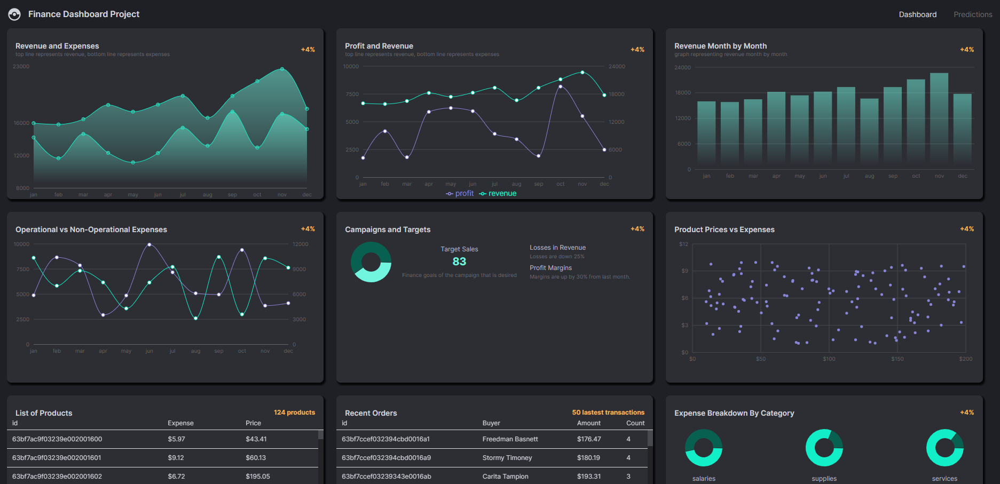

# Financial Dashboard with Predictive Analytics




## Table of Contents
1. [Introduction](#introduction)
2. [Features](#features)
3. [Technologies Used](#technologies-used)
4. [Installation](#installation)
5. [Issues and Solutions](#issues-and-solutions)
6. [Contact](#contact)

## Introduction
A robust financial dashboard built using the MERN stack. This application showcases metrics such as revenue trends, operational expenses, campaign targets, and detailed transaction histories. It also integrates a machine learning component to forecast financial trends, enhancing data-driven decision-making capabilities.

https://finance-dashboard-gold-five.vercel.app/

## Features
- **Dynamic Visualizations**: Real-time visual updates with intuitive data representation.
- **Predictive Analytics**: Uses a linear regression library to predict future financial trends.
- **Detailed Transaction Histories**: Allows users to track every financial detail with ease.
- **Interactive UI**: Optimized for performance and scalability, ensuring a seamless user experience.

## Technologies Used
- **MERN Stack**: MongoDB, Express.js, React.js, Node.js
- **Linear Regression Library**: For predictive analytics.
- **Other Tools**: Various libraries and modules such as Mongo-express, recharts, Material UI, etc. 

## Installation
1. Clone the repository:
   ```sh
   git clone https://github.com/your-username/financial-dashboard.git
2. Navigate to the project directory:
   ```sh
   cd financial-dashboard
3. Install the required packages
   ```sh
   npm install --force
4. Start the server:
   ```sh
   npm start
5. Visit the link that pops up on your terminal that starts with `localhost`

## Issues and Solutions
### Infinitely stretching MUI "Box"
>  Ran into an issue with using a custom object to hold the graphs shown in the website. The Box would stretch infinitely and the recharts graphs along with it. 
>> Online forums claimed that it was a common issue with the recharts library and suggested a bandaid solution where the height is decided by the aspect ratio rather than the container. 
>> The custom styled box was also limited in height.


## Contact
- Sungwoo Kang
- sungwoo.kang@ucdenver.edu
- Github: https://github.com/SungRKang
- LinkedIn: https://www.linkedin.com/in/sungwoo-kang-b67667247/

